# MaxKB使用文档
## 一、介绍
MaxKB 是一款基于 LLM 大语言模型的知识库问答系统。MaxKB = Max Knowledge Base，旨在成为企业的最强大脑。

开箱即用：支持直接上传文档、自动爬取在线文档，支持文本自动拆分、向量化、RAG（检索增强生成），智能问答交互体验好；

无缝嵌入：支持零编码快速嵌入到第三方业务系统；

多模型支持：支持对接主流的大模型，包括 Ollama 本地私有大模型（如 Meta Llama 3、qwen 等）、通义千问、OpenAI、Azure OpenAI、Kimi、智谱 AI、讯飞星火和百度千帆大模型等。

## 二、模块介绍
访问网址后首先进行登录，管理员默认账号：`admin`，密码：`Tt123456!`

系统分为`应用`，`知识库`和`系统设置`三个模块

### 1、系统设置
系统设置中包括`用户管理`，`团队成员`，`模型设置`和`邮箱设置`

#### 1.1、用户管理
用户管理可以创建用户，修改用户密码，封禁用户和删除用户等操作。
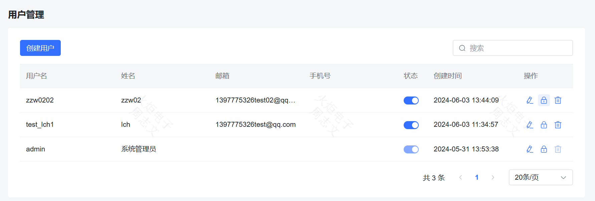
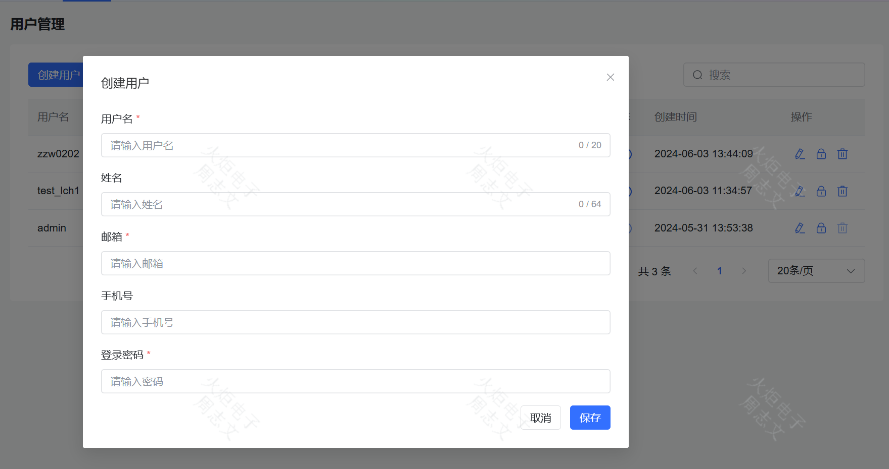

#### 1.2、团队成员
团队成员可以管理小组成员，进行新增或删除，同时对组内成员设置自己所创建的知识库和应用权限，如管理和使用
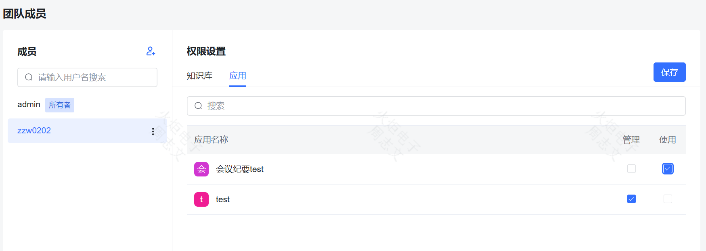

#### 1.3、模型设置
模型设置可以管理模型，接入模型API，支持主流的大模型，包括 Ollama 本地私有大模型（如 Meta Llama 3、qwen 等）、通义千问、OpenAI、Azure OpenAI、Kimi、智谱 AI、讯飞星火和百度千帆大模型等。
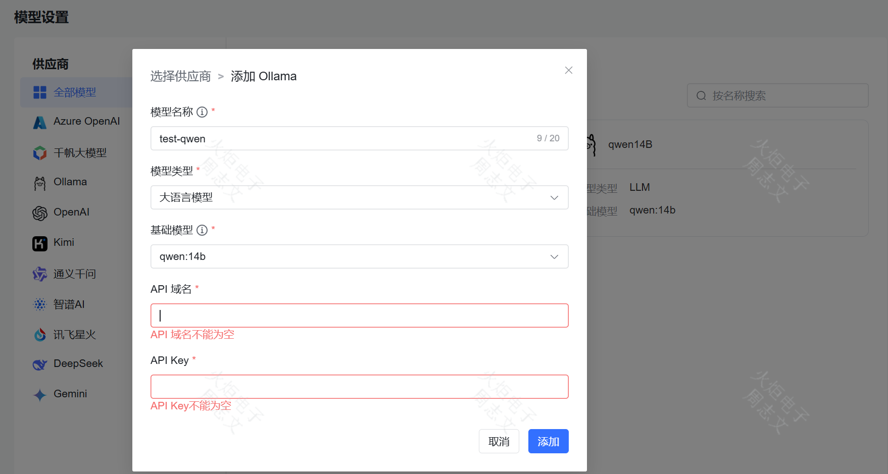

#### 1.4、邮箱设置
设置邮箱用于修改密码等操作
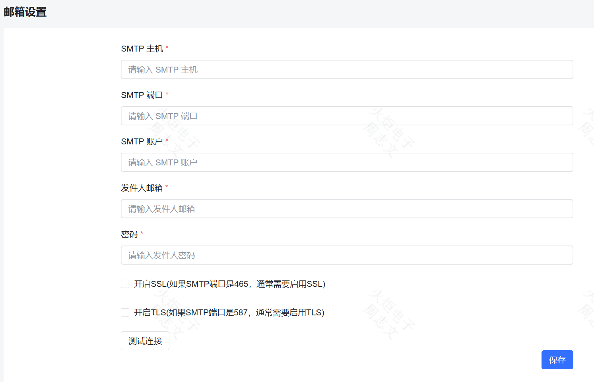

### 2、知识库
#### 2.1、创建
知识库页面可以上传各种类型的文件，如txt，Markdown，pdf，docs等文本文件和QA问答对的execl，csv等格式的文件，还可以通过网址去抓取页面内容形成知识库。
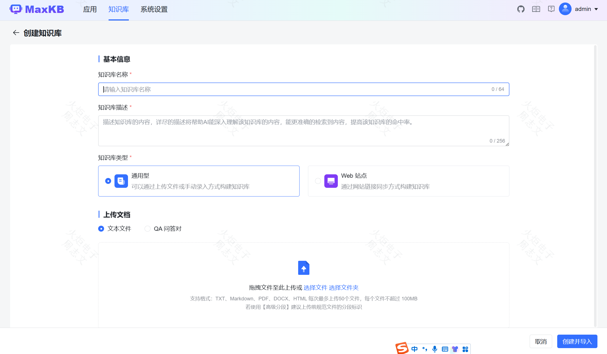

#### 2.2、使用
知识库的使用需搭配应用通过大模型的对话进行使用
##### 2.2.1、文档
文档可以对上传的知识库进行管理操作，包括启停，重向量化，修改命中处理方式，迁移，导出和删除等
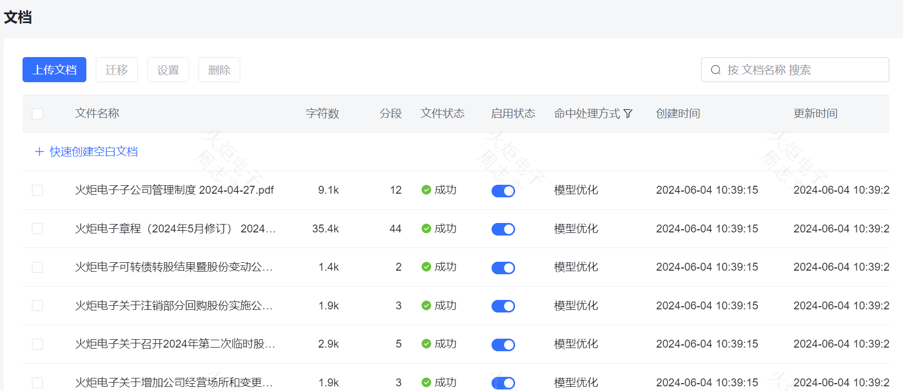
##### 2.2.2、问题
当上传文档后，系统会将文档进行向量化，同时切分为许多分段，在问题处可以设置问题关联分段，让AI的回答更加准确
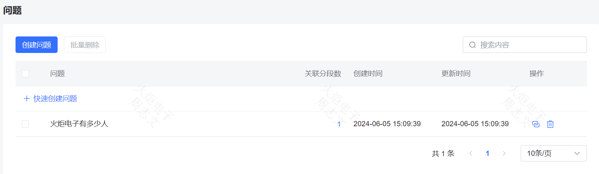
##### 2.2.3、命中测试
命中测试可以通过选择检索方式，针对用户提问调试段落匹配情况，保障回答效果。
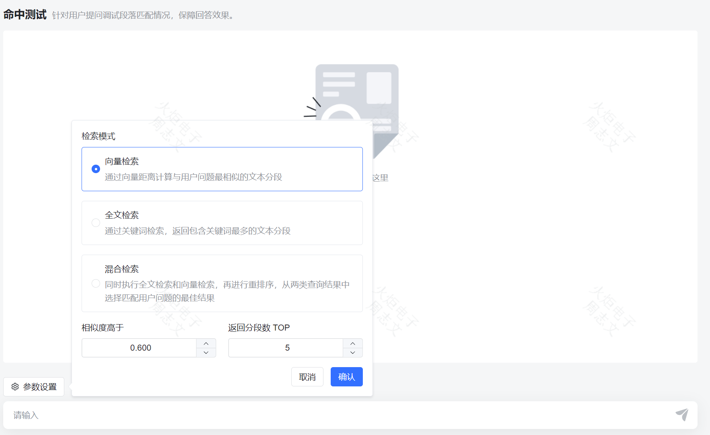
##### 2.2.4、设置
设置中能修改知识库的名称，描述和关联应用
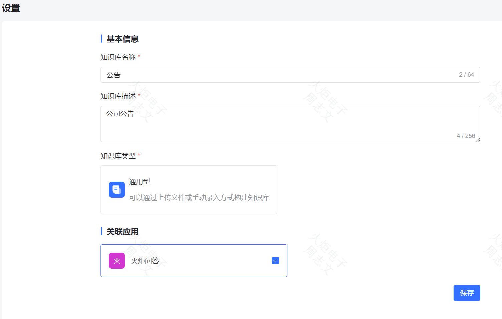

### 3、应用
#### 3.1、创建
首页可以创建对话应用，设置应用名称，应用描述，AI模型，提示词，关联知识库等信息进行应用的创建
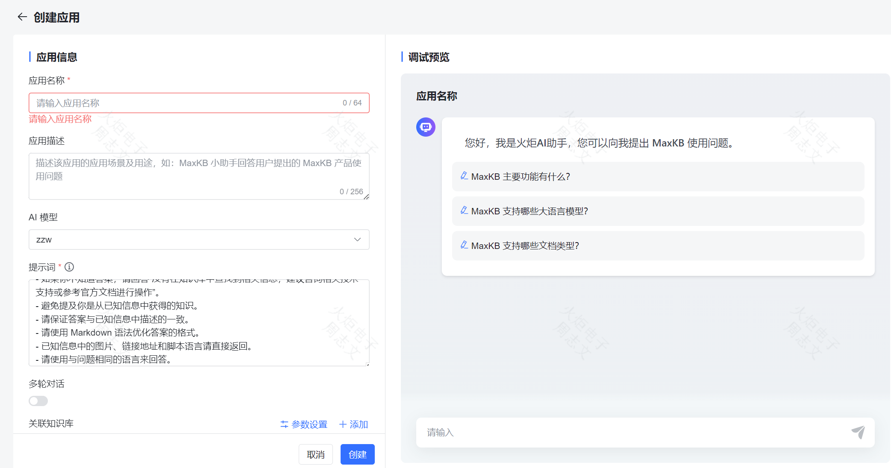

##### 3.1.1、提示词
设置提示词时，知识库对话应用与普通对话应用应区分提示词如

知识库对话应用：
```
已知信息：
{data}
回答要求：
- 请使用简洁且专业的语言来回答用户的问题。
- 如果你不知道答案，请回答“没有在知识库中查找到相关信息，建议咨询相关技术支持或参考官方文档进行操作”。
- 避免提及你是从已知信息中获得的知识。
- 请保证答案与已知信息中描述的一致。
- 请使用 Markdown 语法优化答案的格式。
- 已知信息中的图片、链接地址和脚本语言请直接返回。
- 请使用与问题相同的语言来回答。
问题：
{question}
```
通过调整提示词内容，可以引导大模型聊天方向，该提示词会被固定在上下文的开头。可以使用变量：{data} 是携带知识库中已知信息；{question} 是用户提出的问题。

普通对话应用：
```
回答要求：
- 请使用简洁且专业的语言来回答用户的问题。
- 请保证答案与已知信息中描述的一致。
- 请使用 Markdown 语法优化答案的格式。
- 请使用与问题相同的语言来回答。
问题：
{question}
```
如果需要特定领域需求的应用，则修改提示词即可

##### 3.1.2、关联知识库
前文创建知识库后，在创建应用处进行知识库的关联，可以调整知识库的检索参数，如图
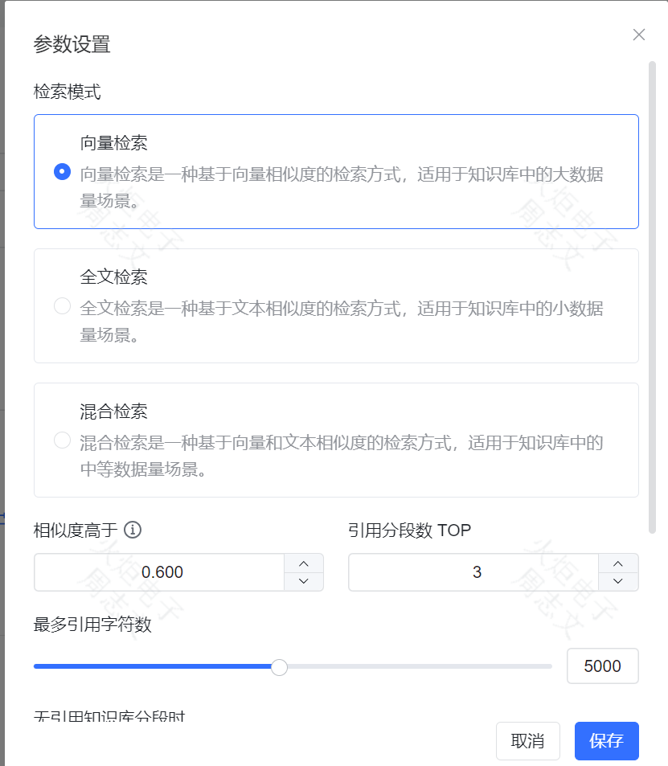

##### 3.1.3、开场白
可以设置应用的开场白，如图所示
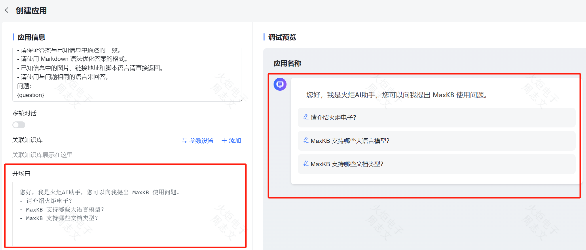

#### 3.2、管理
应用的管理分为概览，应用设置，命中测试和对话日志，由应用创始人进行管理或授权给其他用户进行管理。

#### 3.3.1、概览
概览有应用的应用信息和应用使用统计，应用信息可以进行演示，嵌入第三方和设置访问限制等操作等，统计信息可以查看用户使用情况
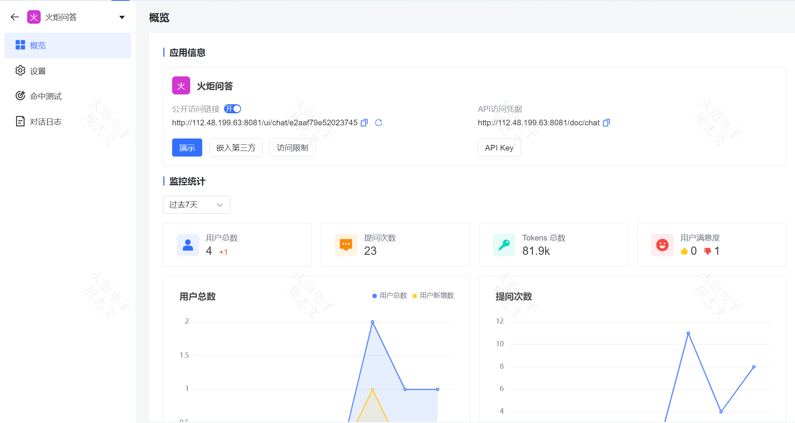

#### 3.3.2、设置
设置可以修改应用名称，应用描述，AI模型，提示词，关联知识库等信息
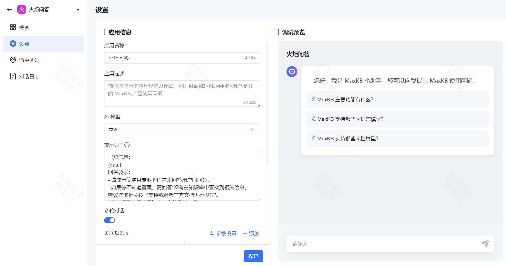

## 三、使用
### 通过应用的演示功能进行对话
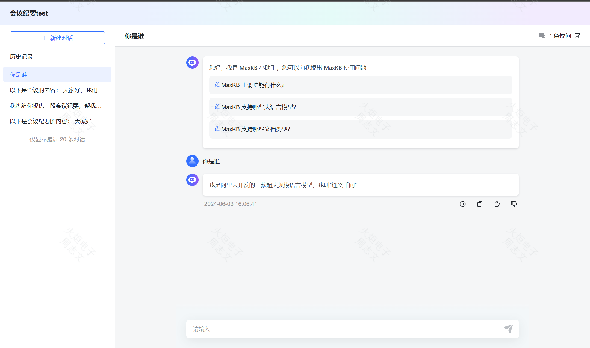

### 通过嵌入第三方进行使用
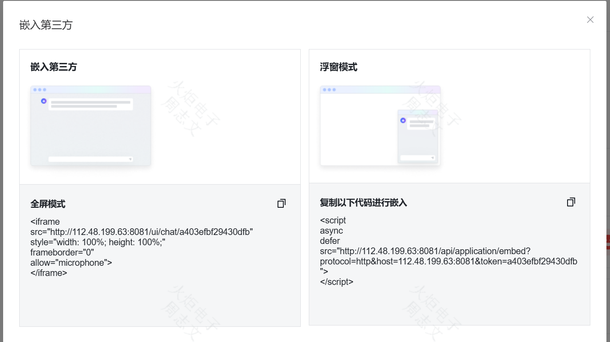

### 通过API接口进行使用
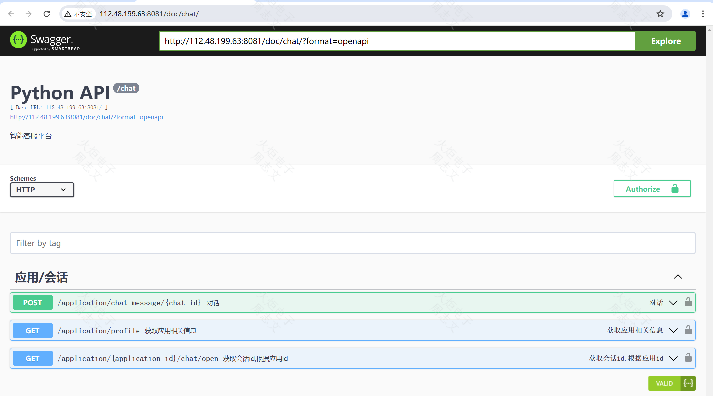

## 四、GitHub地址
https://github.com/1Panel-dev/MaxKB